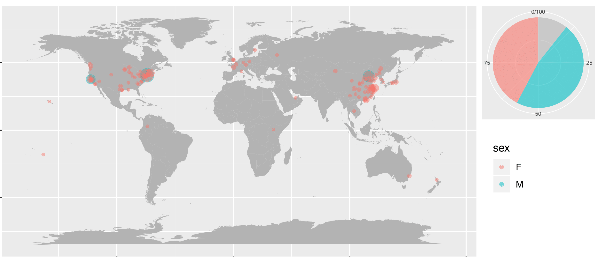

### Introduction 
WeChat, similar to Fackbook, is the dominant multi-purpose social media app in China. A lot can be revealed by one's WeChat social circle. Here I explored mine just for fun. Some details removed due to privacy concerns.

### Insights:   
1. While rooted in Beijing, I've spent years in New York, do I have more friends here or in hometown ?  
I have more friends in New York than in Beijing, perhaps because I'm socially more active these years. As geo location can be changed by users, some outlier locations such as places in Africa are likely jokes.  
2. It says there's a gender imbalance: more girls in New York and vice versa in the West coast, dose that also apply to my data ?  I have slightly more Male friends than Female in both coasts, although I feel there are more girls in my social circle. Perhaps because I graduated from a university known for enginnering hence more alumni here.  

### Methods
1. use itchat API to get WeChat data  
2. EDA and data cleaning to reduce redundancy  
3. use geopy to get longitude and latitude information by city names  
4. use rpy2 to visualize data on world map with R/ggplots  

